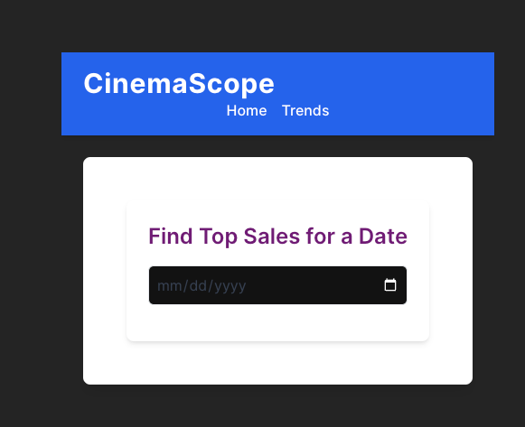
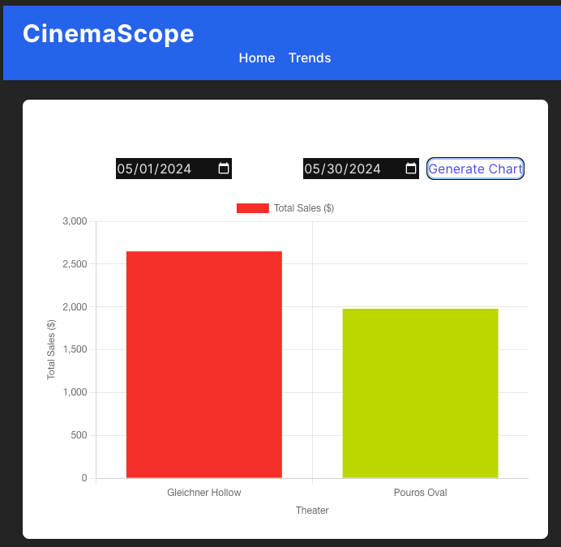

# CinemaScope Project

## Project Overview

Cinema Scope is an application designed to analyze trends in the industry to better understand box office performance.

### Pre-requisites

- docker
- docker-compose
- PHP
- Laravel
- Node.js and npm
- MySQL database


### Clone the Repository:
```
git clone https://github.com/rdbindia/CinemaScope.git

cd CinemaScope
```

### Install Dependencies:
```
composer install

cd frontend 
npm install
```

### Setup Environment:
- Copy .env.example to .env.
- Configure your database credentials and other environment variables in the .env file.

`docker compose up --build -d`

`php artisan key:generate`

### Run Frontend:
`cd frontend`

`npm run dev`

### Run migrations and seeders:

`php artisan migrate`

`php artisan db:seed`


## API Endpoints:

- Fetches the theater with the highest sales for a specific date.
  - GET /api/sale
  - Parameters: date (YYYY-MM-DD)
  - Example : /api/sale?date=2024-05-09

- Fetches total sales by theater for a specified date range
  - GET /api/trends
  - Parameters: start_date (YYYY-MM-DD) (required), end_date(YYYY-MM-DD)(optional)
  - Example : /api/trends?start_date=2024-05-01&end_date=2024-05-31

## Screenshots:

**Sale By Date - <frontend_URI>/**

 

**Movie Sale Trends - <frontend_URI>/trend**



## Running the Tests for frontend and backend:

- **Front end test**:

`cd frontend`
`npm run test`

- **Backend test**

`php artisan test`
