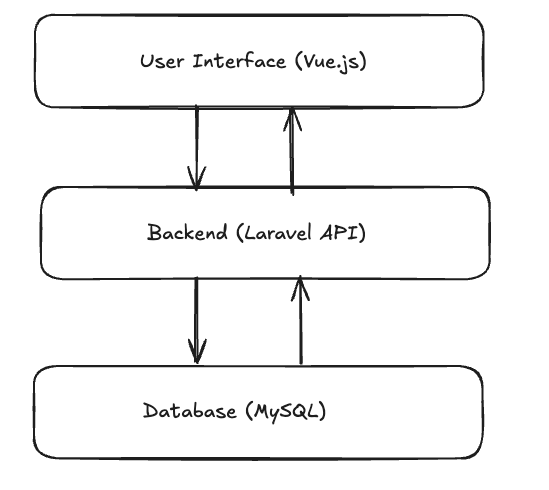
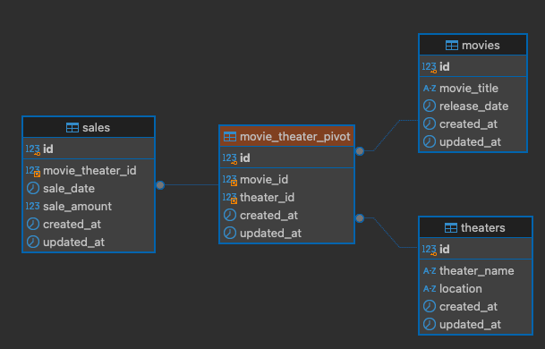

# Software Design Document (SDD)

## 1. Introduction

### 1.1 Purpose

The purpose of this document is to describe the design and architecture of CinemaScope, an application that tracks movie sales data across theaters. 

### 1.2 Scope

This project enables users to analyze sales trends by movie and theater, filtering data by date range to find the highest sales for a given day. 

## 2. System Overview

CinemaScope is composed of a Laravel backend for data handling, a Vue.js frontend for data visualization, and MySQL as the database. It uses Chart.js for data visualization on the frontend.

## 3. Architecture

## 4. Database Design

## 5. API Design
- GET /api/trends: Returns sales trends for specified date range.
- GET /api/sale: Returns the highest sales for a specific date.

## Future Enhancements
- Dockerise Vue
- Improve performance for large data sets with caching.
- Add more advanced filtering and reporting features.
